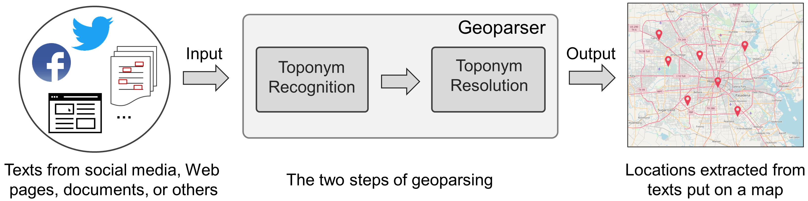
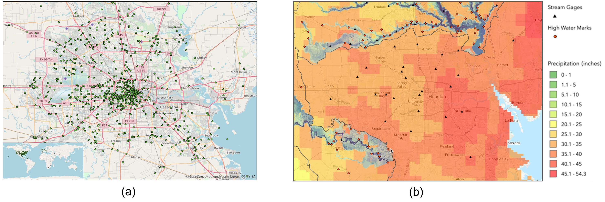

# How do people describe locations during a natural disaster: an analysis of tweets from Hurricane Harvey

**Update**: The annotated data in this repository are outdated. We recommend using the newly annotated data in the new repository [here](https://github.com/geoai-lab/Geo-knowledge-guided-GPT-models-for-disaster-response/tree/main/data).  

### Overall description
Social media platforms, such as Twitter, have been increasingly used by people during natural disasters to share information and request for help. Hurricane Harvey was a category 4 hurricane that devastated  Houston, Texas, USA in August 2017 and caused catastrophic flooding in the Houston metropolitan area. Hurricane Harvey also witnessed the widespread use of social media by the general public in response to this major disaster, and geographic locations are key information pieces  described in many of the social media messages. A  geoparsing system, or a geoparser, can be utilized to automatically extract and locate the described locations, which can help first responders reach the people in need. While a number of geoparsers have already been developed, it is unclear how effective they are in recognizing and geo-locating the locations described by people during natural disasters. To fill this gap, this work seeks to understand how people describe locations during a natural disaster by analyzing a sample of tweets posted during Hurricane Harvey. We then identify the limitations of existing geoparsers in processing these tweets, and discuss possible approaches to overcoming these limitations. 

This repository contains the annotated tweets and the regular expression used for extracting the sample of the analyzed tweets. More details about this work are available in our full paper:

<I>Hu, Y. and Wang, J. (2021): How Do People Describe Locations During a Natural Disaster: An Analysis of Tweets from Hurricane Harvey. In K. Janowicz and J. A. Verstegen, editors, the 11th International Conference on Geographic Information Science (GIScience 2021) - Part I, volume 177, pages 6:1-6:16, Dagstuhl, Germany.</I>  [[PDF]](https://doi.org/10.4230/LIPIcs.GIScience.2021.I.6)
 

<br />
<br />

<p align="center">

<br />
Figure 1. The typical process of geoparsing  text to extract locations.
</p>

<br />
<br />
<p align="center">

<br />
Figure 2. A comparison of the locations of geotagged tweets and the precipitation during Hurricane Harvey: (a) locations of the geotagged tweets; (b) precipitation in the Houston area from the USGS.
</p>
<br />


### Repository organization

* The folder "AnnotatedData" contains the 1,000 tweets annotated based on the ten categories of location descriptions discussed in the paper.
* The folder "RegularExpression" contains the regular expression and location terms used for retrieving the sample of tweets for analysis. The original Hurricane Harvey dataset is available at: https://digital.library.unt.edu/ark:/67531/metadc993940/


### Reference
```
@InProceedings{hu_et_al:LIPIcs:2020:13041,
  author =	{Yingjie Hu and Jimin Wang},
  title =	{{How Do People Describe Locations During a Natural Disaster: An Analysis of Tweets from Hurricane Harvey}},
  booktitle =	{11th International Conference on Geographic Information Science (GIScience 2021) - Part I},
  pages =	{6:1--6:16},
  series =	{Leibniz International Proceedings in Informatics (LIPIcs)},
  ISBN =	{978-3-95977-166-5},
  ISSN =	{1868-8969},
  year =	{2021},
  volume =	{177},
  editor =	{Krzysztof Janowicz and Judith A. Verstegen},
  publisher =	{Schloss Dagstuhl--Leibniz-Zentrum f{\"u}r Informatik},
  address =	{Dagstuhl, Germany},
  URL =		{https://drops.dagstuhl.de/opus/volltexte/2020/13041},
  URN =		{urn:nbn:de:0030-drops-130410},
  doi =		{10.4230/LIPIcs.GIScience.2021.I.6},
  annote =	{Keywords: Geoparsing, geographic informational retrieval, social media, tweet analysis, disaster response}}
```
